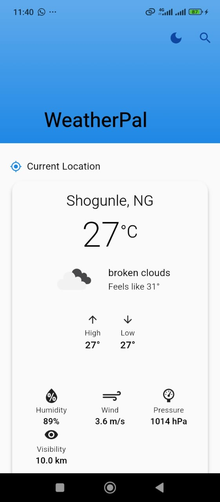
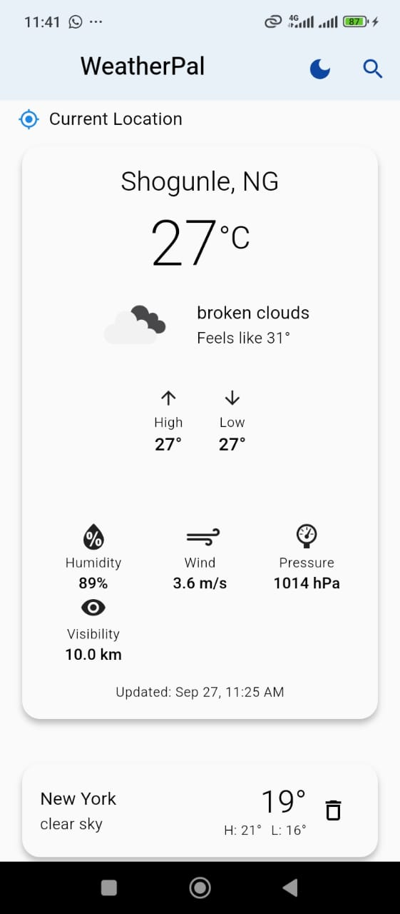
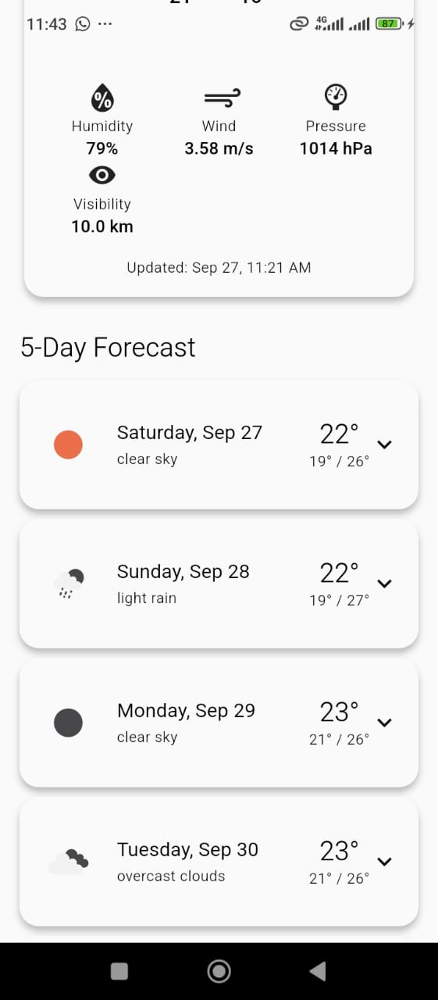
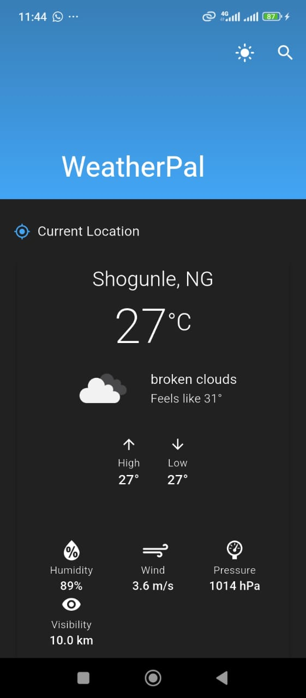

# 🌤️ WeatherPal

A beautiful, intuitive weather application built with Flutter that delivers accurate weather information with a delightful user experience. Built following Clean Architecture principles and modern development practices.

## 🚀 Features
- ✅ Real-time weather data
- ✅ 5-day forecast
- ✅ Location-based weather
- ✅ Dark/Light theme
- ✅ Offline support

## 📸 Screenshots

## 🏗️ Architecture
This app uses Clean Architecture with:
- Presentation Layer (Flutter + Riverpod)
- Domain Layer (Business Logic)
- Data Layer (API + Local Storage)

## 🛠️ Tech Stack
- Flutter 3.x
- Riverpod for state management
- Dio for networking
- Freezed for immutable models
